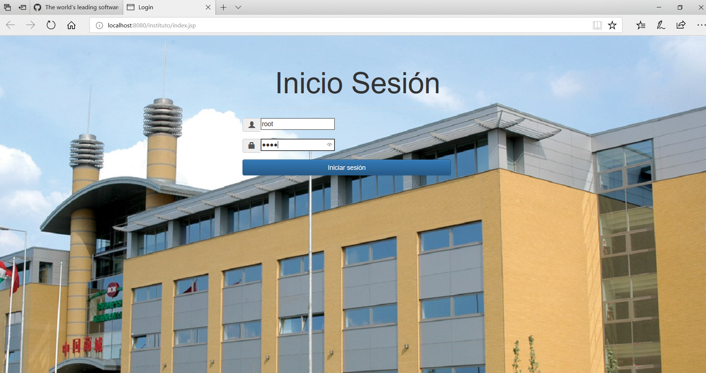
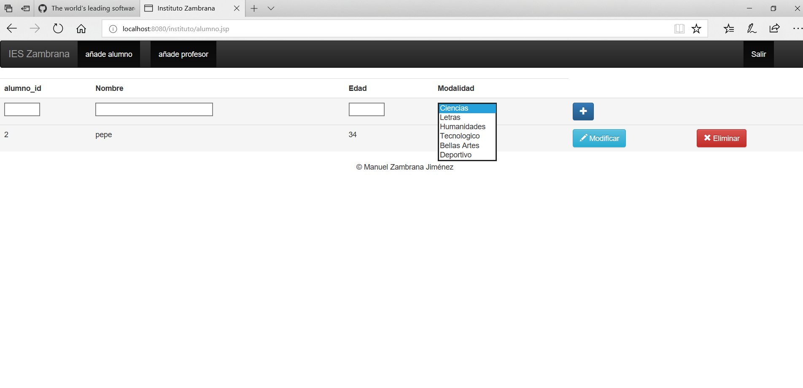
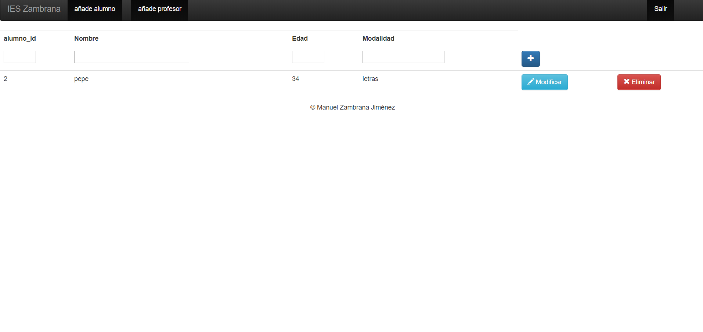
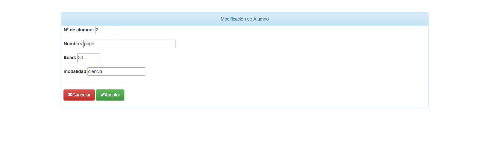
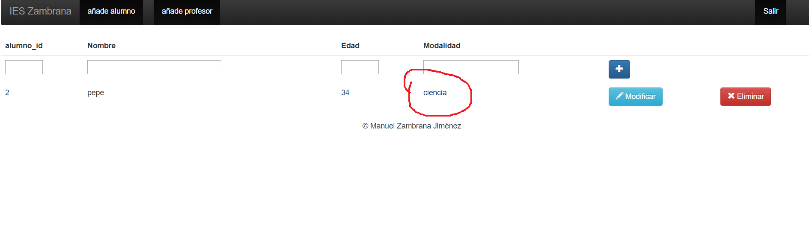

> # :copyright: https://github.com/manuelzambrana/crudv2.0
> **Proyecto bifurcado**
>
> ## MYSQL
> - Usuario: root
> - Contraseña: (sin contraseña)
> - Base de datos: **instituto**
>
> ## DESPLIEGUE EN UBUNTU 
>
> ### Instalación de software
> ```console
> sudo  apt  install  git  mysql-client  mysql-server  tomcat8  tomcat8-admin 
> ``` 
> ### Descarga de código fuente
> ```console
> git  clone  https://github.com/iesvelez-daw/JSP_CRUD_instituto.git  &&  cd  JSP_CRUD_instituto
> ```
>
> ### Introducción de datos
> ```console
> sudo su  # (Introducidos nuestra contraseña, para obtener acceso como root)
> 
> # Cambiamos el plugin de autenticación de auth_socket a mysql_native_password. 
> # Es necesario para que la aplicación conecte correctamente al servidor MySQL.
> echo "ALTER USER 'root'@'localhost' IDENTIFIED WITH mysql_native_password BY ''" | mysql -u root
>
> echo "drop database if exists instituto; create database instituto" | mysql -u root
> cat BBDD/profesor.sql BBDD/alumno.sql | mysql -u root -D instituto
> ```
> ### Despliegue en Tomcat 8
> ```console
> sudo su  # (Introducidos nuestra contraseña, para obtener acceso como root)
> 
> cp  mysql-connector-java-5.1.21.jar  /var/lib/tomcat8/lib
> cp  -r  instituto/web  /var/lib/tomcat8/webapps/instituto
> ```
>
> ### Ejecutar aplicación
>
> Abrimos en el navegador la URL http://localhost:8080/instituto
>


# CRUD_JSP 2.0

Este ejercicio consistirá en un CRUD sobre los datos de un instituto, donde tendremos tablas como: Alumnos, Profesores, asiganturas,material etc...


El inicio sesión del crud costa de un usuario y contraseña para poder entrar
(root,root usuario,usuario admin,admin)



Una vez dentro podremos ver un simple inicio con LoremIpsum para rellenar
Aquí podremos ver una barra de navegación también


En añade alumnos podremos entrar a una pestaña para poder añadir alumnos y podemos elegir una modalidad con un arraylist



Eliminar (como el alumno con id 1)



modificar (como el alumno 2 donde cambio su modalidad ) y comprobamos que funciona 



Una vez modificado podremos volver a la pagina principal o a la lista de alumnos


Y aquí vemos el cambio de alumno




En el inicio podremos acceder al repositorio del CRUD clickeando en GitHub.


El funcionamiento de la tabla profesor es igual que la de alumnos donde podremos
editar profesores, añadir y borrar


